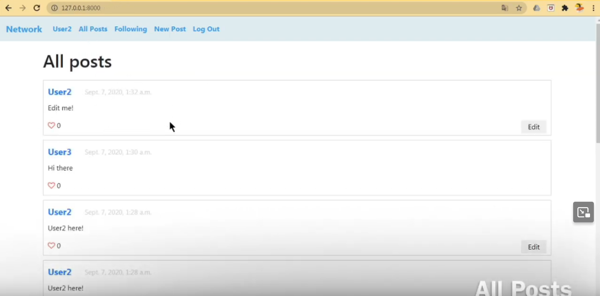

# Network
## A Twitter-like social network website
Project 4 - [CS50’s Web Programming with Python and JavaScript](https://cs50.harvard.edu/web/2020/)

Implemented using the Django framework and JavaScript.

For a full demo, see [this video](https://www.youtube.com/watch?v=SBzqmX1nhU4&list=PL63wdUW0APKvFys2It2Ubgs6DslKpblW8).

### Specification

- New Post: Users who are signed in should be able to write a new text-based post by filling in text into a text area and then clicking a button to submit the post.

- All Posts: The “All Posts” link in the navigation bar should take the user to a page where they can see all posts from all users, with the most recent posts first.

- Profile Page: Clicking on a username should load that user’s profile page.

- Following: The “Following” link in the navigation bar should take the user to a page where they see all posts made by users that the current user follows.

- Pagination: On any page that displays posts, posts should only be displayed 10 on a page.
  
- Edit Post: Users should be able to click an “Edit” button or link on any of their own posts to edit that post.

- “Like” and “Unlike”: Users should be able to click a button or link on any post to toggle whether or not they “like” that post.
